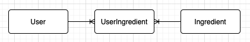

# What's in the Fridge? - Frontend

## Introduction
Let's say you are cooking a new recipe and it calls for an ingredient that you aren't familiar with cooking. The new recipe did not use up that new ingredient and now it will likely just sit in your fridge until it goes bad and you have to throw it away. If only there were an app that could give you ideas on how to use that ingredient again. This is the problem our app seeks to solve.

Logged in users can add ingredients to their fridge and then search for recipes with that ingredient.

## Technologies
Project is created with:
- React 17.0.2
- React-Router 5.2.0
- JWT 2.2
- bcrypt 3.1.7 
- Ruby 2.6.1
- Rails 6.1.3
- Active Model Serializers 0.10.12
- httparty 0.18.1

## Launch
To launch this app, you will also need to open the backend part of this project, found here: https://github.com/moshriguez/whats-in-the-fridge-backend. 

Open the backend project, cd into its directory and run:

```
$ bundle install
$ rails db:migrate
$ rails db:seed
$ rails s
```
Then on the frontend project, cd into the frontend directory and run:
```
$ yarn install
$ yarn start
```

## Video Demo
<a href="https://www.loom.com/share/176d2e296731419e90a2bde95143e59d?sharedAppSource=personal_library" target="_blank">What's in the Frigde? Walkthrough Video</a>

## Models


- User:
    - username
    - password_digest
    - bio
    - favorite_food
- Ingredient:
    - name
    - description
- UserIngredient:
    - user_id
    - ingredient_id

## User Stories:
Users will be able to:
- [x] Log in to their account
- [x] Create an account
- [x] Edit their profile info
- [x] Delete their account
- [x] Search for ingredients if not logged in
- [x] Add ingredients to their fridge
- [x] Click on an item to perform a search for recipes

## Stretch Goals:
- [] Use multiple ingredients to search for a recipe
- [] Make user’s fridge look like a fridge
- [] Add shopping list component so users can add missing ingredients for a recipe to shopping list